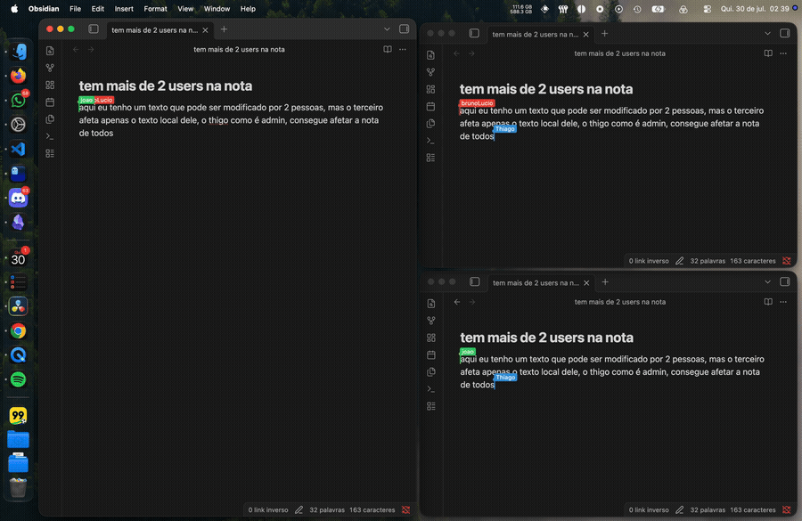

<div align="center">

# ObSync

**Self-hosted, real-time collaborative Markdown editing for Obsidian.**


</div>

ObSync pairs an Obsidian plugin with a self-hosted Node.js backend so a vault
can be edited by several people at once, with every change synchronized
in real time through [Yjs](https://yjs.dev) CRDTs over a WebSocket connection
to that backend. There's no third-party service in the loop: you run the
backend yourself, and every account that connects to it is assigned one of
two roles, with no limit on how many accounts can hold either one:

- **`admin`** accounts publish changes to the shared vault, so anything they
  write becomes part of what every other connected account sees.
- **`user`** accounts edit locally and receive whatever admins publish, but
  their own edits stay private and are never sent back to the shared vault.

## Demo



## Contents

- [Demo](#demo)
- [How synchronization works](#how-synchronization-works)
- [Repository layout](#repository-layout)
- [Documentation](#documentation)
- [Getting started](#getting-started)
- [Development](#development)

## How synchronization works

```text
Admin
Editor <-> Yjs document <-> WebSocket <-> server

User
Server -> network document -> private document -> editor
Editor -> private document -> IndexedDB
```

A `user` account's edits live only in a private Yjs document that's stored in the local IndexedDB database, while a separate network document is the one that actually receives updates from the server. Because the WebSocket provider is only ever attached to that network document, private history has no path back to the server even if the client tried to send it. The server enforces the same boundary independently on its side, rejecting any Yjs update that arrives from an account that isn't an admin, so the guarantee doesn't rely on the plugin behaving correctly.

## Repository layout

The codebase is split into three top-level workspaces, each with a single responsibility:

```text
backend/         HTTP API, WebSocket server, authentication, and shared storage
plugin/obSync/   Obsidian plugin source and build configuration
docs/            architecture and operational documentation
```

## Documentation

Beyond this README, the `docs/` directory holds the reference material you'll want once you're past initial setup: architecture decisions, the full HTTP and WebSocket API surface, and the operational guides referenced throughout this file.

- [Documentation index](docs/README.md)
- [System overview](docs/overview.md)
- [Architecture](docs/architecture.md)
- [API reference](docs/reference/README.md)
  - [Plugin classes and methods](docs/reference/plugin/README.md)
  - [Backend services](docs/reference/backend/README.md)
  - [HTTP API](docs/reference/backend/http.md)
  - [WebSocket API](docs/reference/backend/websocket.md)
- [Concepts and operational guides](docs/README.md#concepts)

## Getting started

These steps take a fresh clone to a signed-in plugin talking to your own
backend. Run them from the repository root unless noted otherwise.

### 1. Install dependencies

```bash
npm install
```

### 2. Configure the backend

Generate a signing secret. This is a random value, not a password you choose:

```bash
openssl rand -base64 48
```

Create `backend/.env`:

```dotenv
OBSYNC_TOKEN_SECRET=<paste the value generated above>
PORT=3000
OBSYNC_HOST=127.0.0.1
OBSYNC_REQUIRE_TLS=false
OBSYNC_TRUST_PROXY=false
```

These values are meant for local development only, where the backend never
leaves your own machine. Before you expose it to anyone else, even just
another device on your network, read
[Security: transport rules](docs/security.md#transport-rules) and adjust
this configuration for that kind of deployment first.

### 3. Create and seed the user database

```bash
npm run db:setup
```

This step is deliberately a one-time thing: it refuses to touch an existing
`backend/data/users.sqlite`, and separately, the backend itself refuses to
start against a database that's missing or invalid, so there's no accidental
way to reseed over real data. When it succeeds, it prints one line per
seeded account along with a random temporary password, for example:

```text
[Database] Seed: initial accounts created.
[Database]   thiago@gmail.com — temporary password (admin): Ax7f...
[Database]   brunoestudos6@gmail.com — temporary password (user): Qm2k...
[Database] Save these passwords now: they will not be shown again.
```

**Copy the admin account's temporary password now**, since that terminal
output is the only place it will ever be shown and you'll need it to sign in
during step 6. The full list of seeded accounts, and how to rotate any of
these passwords once you're up and running, is covered in
[Security: account passwords](docs/security.md#account-passwords).

### 4. Start the backend

```bash
npm run dev --workspace=backend
```

Leave this running in its own terminal for as long as you plan to use the
plugin. It needs to stay up the whole time you're editing, and it logs
`Server running on http://127.0.0.1:3000` once it's ready to accept
connections.

### 5. Build and install the plugin

```bash
npm run build --workspace=plugin/obSync
```

Copy `plugin/obSync/main.js`, `manifest.json`, and `styles.css` into
`<vault>/.obsidian/plugins/obSync/` in the Obsidian vault you want to test
with, then in Obsidian: enable **Community plugins** if you haven't already,
and turn on **ObSync** in the plugin list.

### 6. Connect and sign in

Open **Settings → ObSync**. Since no account is connected yet, the only field
shown is the **Backend server URL**. Enter `http://127.0.0.1:3000` and save
it, using `127.0.0.1` rather than `localhost` (see
[Troubleshooting](docs/debugging.md#plugin-cant-reach-a-local-backend) if
you're curious why that distinction matters). Saving it reveals a
**Sign in** button, where you log in with the admin e-mail and the temporary
password that step 3 printed to your terminal.

### 7. Change the temporary password

Go to **Settings → ObSync → Account → Change password** and set a real
password before doing anything else with this account, since the temporary
one only ever appeared once, printed to your terminal, and can't be
retrieved again once you've moved past it.

### 8. Next steps

- As admin, add more accounts under **Settings → ObSync → User management**
  (shown in Portuguese as "Administração de usuários" if Obsidian is set to
  that language). Each person installs the same plugin build and connects
  to the same backend URL, then signs in with their own account.
- Only `admin` accounts publish edits to the shared vault; `user` accounts
  edit locally and receive shared changes. See
  [How synchronization works](#how-synchronization-works).
- Want to reach the backend from outside your own machine? The backend URL
  field takes any custom domain, not just `127.0.0.1`. Put a TLS reverse
  proxy in front of it and point the field at that proxy's HTTPS URL. See
  [Security: transport rules](docs/security.md#transport-rules).

### Installing from the Obsidian Community Plugins directory

Steps 1–5 above are only for the person who builds and runs the backend.
Everyone else installs ObSync from **Settings → Community plugins → Browse**
like any other plugin: Obsidian downloads the release's `main.js`,
`manifest.json`, and `styles.css` for them automatically. They start at
[step 6](#6-connect-and-sign-in): they still need the backend's URL and an
account, both provided by whoever is running that backend.

### Testing across devices on your LAN, without hosting it publicly

The backend refuses plain HTTP on any host other than loopback
(`127.0.0.1`/`localhost`). Binding it to your machine's LAN IP (e.g.
`192.168.1.20`) to reach it from your phone still requires
`OBSYNC_REQUIRE_TLS=true`, which in turn requires a TLS-terminating reverse
proxy (`OBSYNC_TRUST_PROXY=true`). There's no "just open the firewall" mode.

The lightest way to satisfy that on your own network is to run a local
reverse proxy with automatic self-signed HTTPS on the same machine as the
backend, so the backend itself never has to leave `127.0.0.1`. Only the
proxy binds to your LAN IP, and the firewall only needs to open for the
proxy's port, never the backend's. See
[Security: reaching the backend from other devices on your LAN](docs/security.md#reaching-the-backend-from-other-devices-on-your-lan)
for the Caddyfile, firewall commands, and certificate-trust steps.

## Development

Once you're set up, there's no need to rebuild by hand after every change,
since both workspaces support watch mode. Start the backend in watch mode in
one terminal:

```bash
npm run dev --workspace=backend
```

and run the plugin compiler in watch mode in another:

```bash
npm run dev --workspace=plugin/obSync
```

With that running, `plugin/obSync/main.js` is rewritten automatically on
every source change, so picking up the update is just a matter of reloading
the plugin inside Obsidian, or using a hot-reload plugin so you don't even
have to do that.

---

<div align="center">

Made for a self-hosted, private Obsidian vault.

</div>
