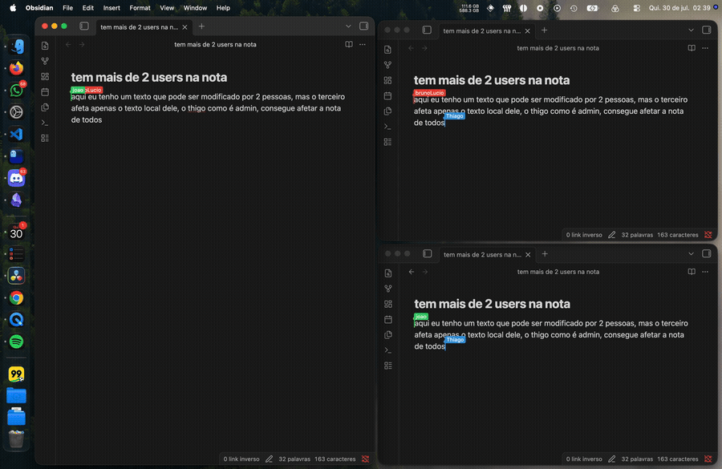

<div align="center">

# ObSync

**Self-hosted, real-time collaborative Markdown editing for Obsidian.**


</div>

ObSync pairs an Obsidian plugin with a Node.js backend that you host yourself,
so several people can work on one vault. The note open in the editor is edited
live, character by character, through [Yjs](https://yjs.dev) over a WebSocket;
everything else in the vault (files, folders, renames, binaries) is kept in
sync over HTTP. No third-party service is involved.

Every account has one of two roles:

- **`admin`** accounts publish their changes to the shared vault, so everyone
  connected sees them.
- **`user`** accounts receive everything admins publish, but their own edits
  stay on their device and are never sent back.

The backend enforces this on its own, so the guarantee does not depend on the
plugin behaving correctly.

## Demonstration



## Contents

- [How it works in one diagram](#how-it-works-in-one-diagram)
- [Repository layout](#repository-layout)
- [Getting started](#getting-started)
- [Development workflow](#development-workflow)
- [Documentation](#documentation)

## How it works in one diagram

```text
Obsidian (plugin)                                   Backend (Node.js)
admin edits active note ─── WSS /<note> (Yjs) ────▶ room: check role, apply, broadcast, save
user edits active note ──── (stays local) 
any client ◀──────────────── WSS /<note> (Yjs) ──── room broadcasts admin edits
admin creates/renames file ─ HTTPS /api/sync/* ───▶ write to vault, broadcast event
any client ◀──────────────── WSS /system ────────── vault events
plugin start ◀────────────── HTTPS /initSync ────── whole vault as ZIP (skipped if unchanged)
```

A `user` account's editor document is never attached to the network: the
plugin keeps a separate network document that only receives. On the server,
Yjs updates from non-admin connections are dropped before they reach the shared
document. Full explanation: [System overview](docs/overview.md).

## Repository layout

```text
backend/         HTTP API, WebSocket server, authentication, vault storage (TypeScript run directly by Node)
plugin/obSync/   Obsidian plugin, bundled into main.js with esbuild
docs/            developer documentation
```

## Getting started

These steps take a fresh clone to a signed-in plugin talking to your own
backend on the same machine. Commands run from the repository root unless a
step says otherwise.

### Requirements

- **Node.js 22.18 or newer.** The backend runs `.ts` files directly (Node's
  built-in type stripping) and uses the built-in `node:sqlite` module, so there
  is no backend build step. The project is developed on Node 26.
- Obsidian 1.13.1 or newer (`minAppVersion` in `plugin/obSync/manifest.json`).

### 1. Install dependencies

```bash
npm install
```

The repository is an npm workspace, so this installs both `backend` and
`plugin/obSync`.

### 2. Configure the backend

Generate a signing secret (a random value, not a password you choose):

```bash
openssl rand -base64 48
```

Create `backend/.env`:

```dotenv
OBSYNC_TOKEN_SECRET=<paste the value generated above>
PORT=3000
OBSYNC_HOST=127.0.0.1
OBSYNC_REQUIRE_TLS=false
OBSYNC_TRUST_PROXY=false
```

This configuration is for local development only. Before exposing the backend
to any other device, read
[Security: transport rules](docs/security.md#transport-rules).

### 3. Create the data folders and the user database

```bash
mkdir -p backend/data/vault
npm run db:setup
```

`backend/data/vault/` is the shared vault. It must exist before the backend
starts ([why](docs/known-issues.md#backend-startup-crashes-when-datavault-is-missing)).
To start with sample content instead of an empty vault, run
`node backend/scripts/generateRandomVault.ts`, which also creates the folder.

`db:setup` refuses to touch an existing database, and the backend refuses to
start without one, so nothing can reseed real data by accident. It prints one
line per seeded account with a random temporary password:

```text
[Database] Seed: initial accounts created.
[Database]   thiago@gmail.com — temporary password (admin): Ax7f...
[Database]   brunoestudos6@gmail.com — temporary password (user): Qm2k...
[Database] Save these passwords now: they will not be shown again. ...
```

**Copy the admin password now.** It is shown only once. The seed accounts are
defined in `backend/users/UserDB.ts`.

### 4. Start the backend

```bash
cd backend
node --watch main.ts
```

`npm run dev --workspace=backend` does not work yet: the script points to a
`server.ts` file that no longer exists
([Known issues](docs/known-issues.md#backend-npm-start-and-npm-run-dev-point-to-a-missing-file)).

Leave it running. It prints `Server running on http://127.0.0.1:3000` when it
is ready. `--watch` restarts it when a backend file changes.

### 5. Build and install the plugin

On a fresh clone, generate the bundled Web Worker once, then build:

```bash
cd plugin/obSync
node esbuild.config.mjs production
npm run build
```

The first command is needed because `npm run build` type-checks before esbuild
generates `src/Workers/zipWorker/zip.worker.generated.ts`
([details](docs/known-issues.md#plugin-the-first-npm-run-build-fails-on-a-fresh-clone)).

Copy `plugin/obSync/main.js`, `manifest.json` and `styles.css` into
`<your vault>/.obsidian/plugins/obSync/`. In Obsidian, enable
**Community plugins** and turn on **ObSync**.

### 6. Connect and sign in

Open **Settings → ObSync**. With no backend configured, only the
**Backend server URL** field is shown. Enter `http://127.0.0.1:3000` (use
`127.0.0.1`, not `localhost`; see
[Troubleshooting](docs/debugging.md#the-plugin-cannot-reach-a-local-backend))
and save. A **Sign in** button appears; sign in with the admin e-mail and the
temporary password from step 3.

The plugin then downloads the shared vault and connects the live channels.

### 7. Change the temporary password

Go to **Settings → ObSync → Account** and set a real password. The temporary
one cannot be shown again.

### 8. Try it with two accounts

Sign in as the `user` seed account in a second vault (or a second device) and
open the same note in both. Text typed by the admin appears in both; text typed
by the user stays only on the user's side. New accounts are created under
**Settings → ObSync → User management**.

### Reaching the backend from other devices

The backend refuses plain HTTP on any address other than loopback. To use it
from a phone or another computer, even on your own network, put a TLS reverse
proxy in front of it. [Security](docs/security.md#reaching-the-backend-from-other-devices-on-your-lan)
has a ready-to-use Caddy setup.

### Installing from the Obsidian Community Plugins directory

Only the person running the backend needs steps 1 to 5. Everyone else installs
ObSync from **Settings → Community plugins → Browse** and starts at step 6 with
the backend URL and an account provided by that person.

## Development workflow

Run two terminals:

```bash
# Terminal 1: backend, restarts on change
cd backend && node --watch main.ts

# Terminal 2: plugin, rebuilds main.js on change
cd plugin/obSync && npm run dev
```

After each plugin rebuild, reload the plugin in Obsidian (or use a hot-reload
plugin). If your development vault is not where the build writes `main.js`,
copy or symlink the three plugin files into the vault's plugin folder.

Type-check both halves:

```bash
cd backend && npx tsc --noEmit -p tsconfig.json
cd plugin/obSync && npx tsc -noEmit -skipLibCheck
```

## Documentation

Start with the [documentation index](docs/README.md). The most useful pages
when you are new:

- [System overview](docs/overview.md): the parts and the main flows
- [Architecture](docs/architecture.md): where each responsibility lives
- [Common changes](docs/common-changes.md): where to edit for typical tasks
- [Known issues](docs/known-issues.md): verified bugs and open questions

---

<div align="center">

Made for a self-hosted, private Obsidian vault.

</div>
